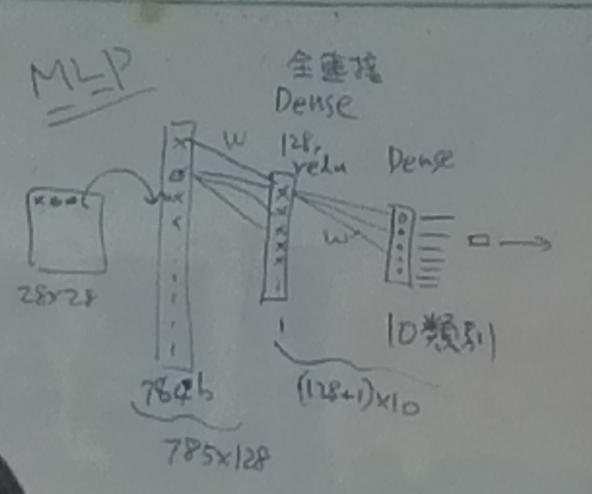

# Tensorflow keras classification example.
### 2020/11/25

>This guide trains a neural network model to classify images of clothing, like sneakers and shirts. It's okay if you don't understand all the details; this is a fast-paced overview of a complete TensorFlow program with the details explained as you go.
[source](https://www.tensorflow.org/tutorials/keras/classification)


### Contents

- [Import tensorflow keras](#import-tensorflow-keras)

- [Import the Fashion MNIST dataset and preprocess](#import-the-Fashion-MNIST-dataset-and-preprocess)

- [Create model, setting and training](#create-model-setting-and-training)

- [Evaluate](#evaluate)

- [Predictions](#predictions)

---

### Import tensorflow keras
```python
# TensorFlow and tf.keras
import tensorflow as tf

# Helper libraries
import numpy as np
import matplotlib.pyplot as plt

# Check tensorflow version
print(tf.__version__)
```

---

### Import the Fashion MNIST dataset and preprocess

```python
# get fashion_mnist dataset from keras.datasets
fashion_mnist = tf.keras.datasets.fashion_mnist

(train_images, train_labels), (test_images, test_labels) = fashion_mnist.load_data()

# class name by index
class_names = ['T-shirt/top', 'Trouser', 'Pullover', 'Dress', 'Coat',
               'Sandal', 'Shirt', 'Sneaker', 'Bag', 'Ankle boot']

# explore the data
train_images.shape
len(train_labels)
train_labels
test_images.shape
len(test_labels)

# show train image with colorbar and no grid
plt.figure()
plt.imshow(train_images[0])
plt.colorbar() # show colorbar
plt.grid(False) # no grid
plt.show()

# scale these values(0 ~ 255) to a range of 0 to 1
# for example:
#   0 / 255.0 eq 0
#   255 / 255.0 eq 1
train_images = train_images / 255.0
test_images = test_images / 255.0

# show train-images
plt.figure(figsize=(10,10))
for i in range(25):
    plt.subplot(5,5,i+1)
    plt.xticks([])
    plt.yticks([])
    plt.grid(False)
    plt.imshow(train_images[i], cmap=plt.cm.binary)
    plt.xlabel(class_names[train_labels[i]])
plt.show()
```

---

### Create model, setting and training


[MLP](https://chih-sheng-huang821.medium.com/%E6%A9%9F%E5%99%A8%E5%AD%B8%E7%BF%92-%E7%A5%9E%E7%B6%93%E7%B6%B2%E8%B7%AF-%E5%A4%9A%E5%B1%A4%E6%84%9F%E7%9F%A5%E6%A9%9F-multilayer-perceptron-mlp-%E9%81%8B%E4%BD%9C%E6%96%B9%E5%BC%8F-f0e108e8b9af) in this case.


```python
# Create model
model = tf.keras.Sequential([
    # adding layers one by one
    tf.keras.layers.Flatten(input_shape=(28, 28)),
    tf.keras.layers.Dense(128, activation='relu'),
    tf.keras.layers.Dense(10)
])

model.compile(optimizer='adam',
              loss=tf.keras.losses.SparseCategoricalCrossentropy(from_logits=True),
              metrics=['accuracy'])
              
model.fit(train_images, train_labels, epochs=10)
```

---

### Evaluate 

```python
# get loss and acc
test_loss, test_acc = model.evaluate(test_images,  test_labels, verbose=2)

print('\nTest accuracy:', test_acc)
```

---


### Predictions

```python
probability_model = tf.keras.Sequential([model, 
                                         tf.keras.layers.Softmax()])
predictions = probability_model.predict(test_images)  

predictions[0]
```

---
